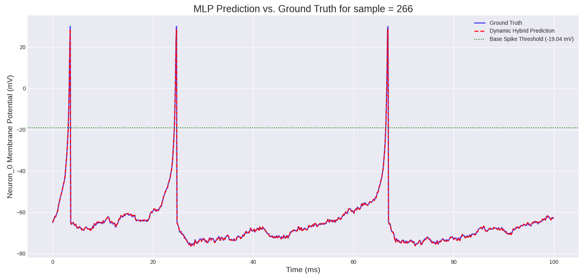

# Neural Spike Train Surrogate: An MLP-based Predictive Model

This project implements a high-fidelity machine learning surrogate for a biologically plausible neuron. It uses a Multi-Layer Perceptron (MLP) to predict the membrane potential of a neuron simulated with the Izhikevich model, accurately capturing both sub-threshold dynamics and sharp action potentials (spikes).

### Final Result

*The final MLP model's prediction (red dashed line) almost perfectly overlays the ground truth from the Izhikevich simulation (blue line) for an unseen test run.*


-----

## Table of Contents

1. [Project Overview](#1-project-overview)
2. [Core Methodology](2-core-methodology)
3. [File Structure](3-file-structure)
4. [Installation & Usage](4-installation--usage)
5. [Results](5-results)

-----

## 1\. Project Overview

Simulating complex biological systems like neurons is computationally intensive. This project demonstrates a powerful alternative: creating a machine learning "surrogate" model that learns the behavior of the simulation and can replicate its output at a fraction of the computational cost.

This pipeline is a complete, end-to-end solution:

* It starts by generating a synthetic, but biologically plausible, dataset of neuron spike trains using the well-known **Izhikevich neuron model**.
* It then processes this data and trains a **Multi-Layer Perceptron (MLP)** using PyTorch to predict the neuron's membrane potential.
* The final trained model is remarkably accurate, proving that a relatively simple feed-forward architecture can successfully learn the complex, non-linear dynamics of a spiking neuron.

-----

## 2\. Core Methodology

The success of this project hinges on a few key design choices:

* **Data Generation:** Instead of relying on external, unreliable data sources, this project includes a script (`generate_data.py`) that creates a rich dataset of 300 simulated experimental "runs." Each run features a 5-neuron network where each neuron is driven by a unique random input current, ensuring a wide variety of dynamic behaviors for the model to learn from.
* **The Izhikevich Model:** The data is generated using the Izhikevich model, which is celebrated for its ability to reproduce a wide variety of spiking behaviors with high computational efficiency. This provides a challenging and realistic target for the ML model to learn.
* **MLP Architecture:** The final predictive model is a simple but effective MLP (`models.py`). This challenges the common assumption that complex recurrent architectures like LSTMs are always necessary for time-series data. With a sequence length of 1, the problem is framed as a regression task, where the MLP excels.
* **Clean Data Pipeline:** The entire data processing workflow (`data_processing.py`) is robust. It correctly separates training and testing data by "run ID" to prevent data leakage and uses standard scaling techniques to prepare the data for the neural network.

-----

## 3\. File Structure

The project is organized into a clean, modular structure:

```
.
├── data/                 # Stores generated data, trained models, and scalers
├── main.py               # Main entry point to run the full pipeline
├── README.md             # This file
├── results/              # Output plots are saved here
└── scripts/
    ├── config.py         # All project-level constants and paths
    ├── generate_data.py  # Script to simulate neuron data
    ├── data_processing.py# Data loading, splitting, and scaling logic
    ├── models.py         # PyTorch MLP model definition
    ├── training.py       # The training loop for the MLP
    └── prediction.py     # Script to load a model and make predictions
```

-----

## 4\. Installation & Usage

### Prerequisites

* Python 3.9+
* PyTorch
* scikit-learn
* Pandas, NumPy, Matplotlib, Joblib, XGBoost

### Installation

Clone the repository and install the required packages:

```bash
git clone https://github.com/yashkc2025/neuron_surrogate
cd neuron_surrogate
pip install -r requirements.txt
```

### Running the Pipeline

The `main.py` script is the primary entry point and will execute the entire workflow from start to finish.

```bash
# This command will:
# 1. Generate the 'spike_dataset.csv' if it doesn't exist.
# 2. Train the MLP model and save it to the /data directory.
# 3. Run predictions on 2 random test runs and save the plots to the /results directory.
python main.py 2
```

You can change the number `2` to generate plots for a different number of test runs.

-----

## 5\. Results

The final MLP model demonstrates an exceptionally high degree of accuracy in predicting the neuron's membrane potential, including the precise timing and amplitude of action potentials.

*As shown in the plot for a representative test run, the model's prediction (red) accurately captures both the noisy sub-threshold behavior and the sharp, non-linear spikes of the ground truth (blue).*

This result validates the project's core hypothesis: a well-trained MLP can serve as a highly effective, computationally efficient surrogate for a complex, dynamic biological simulation.
